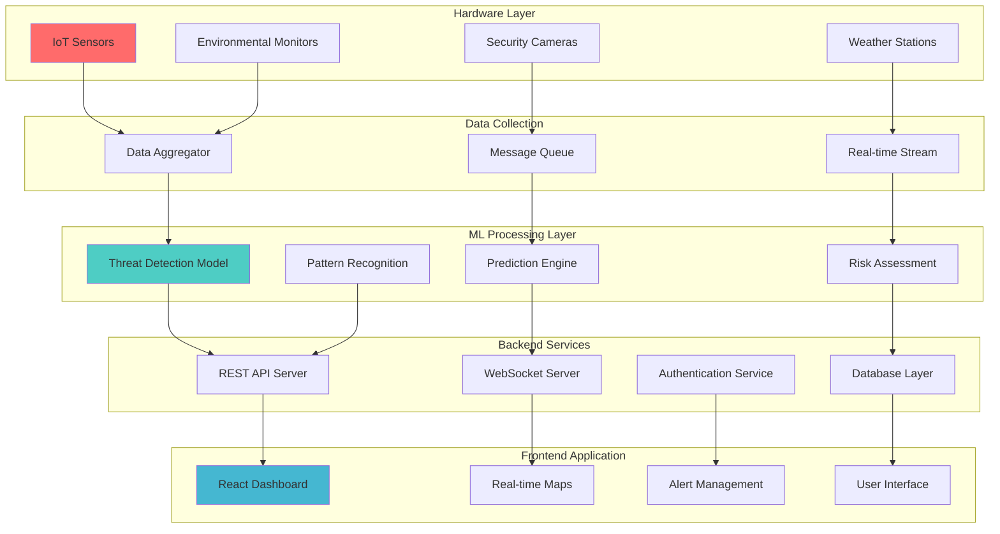
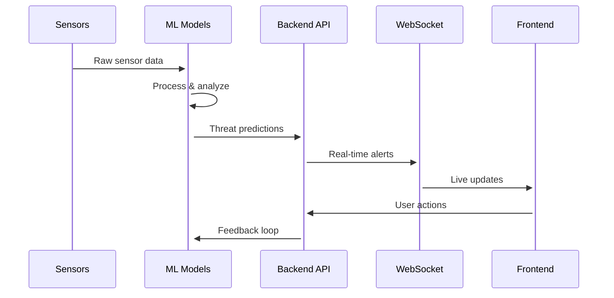
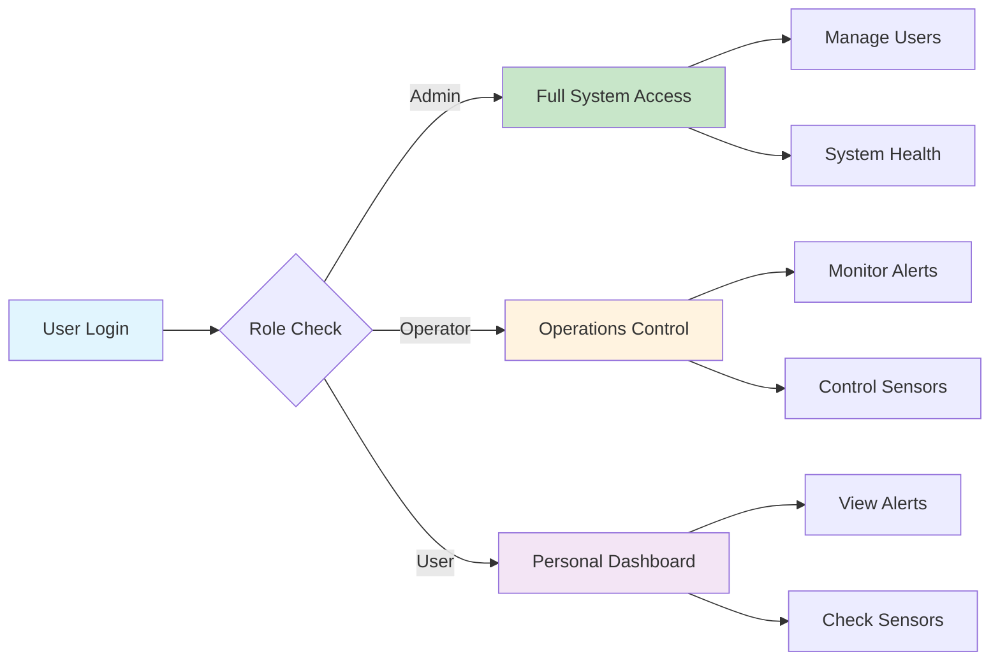
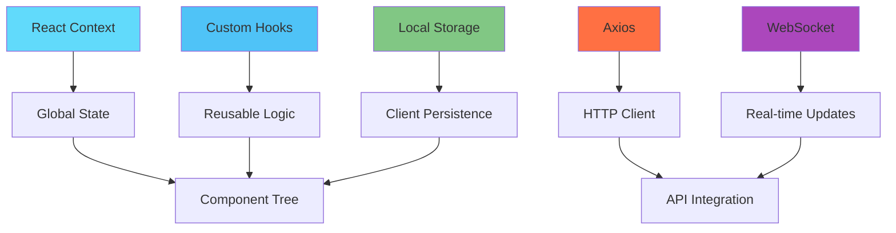
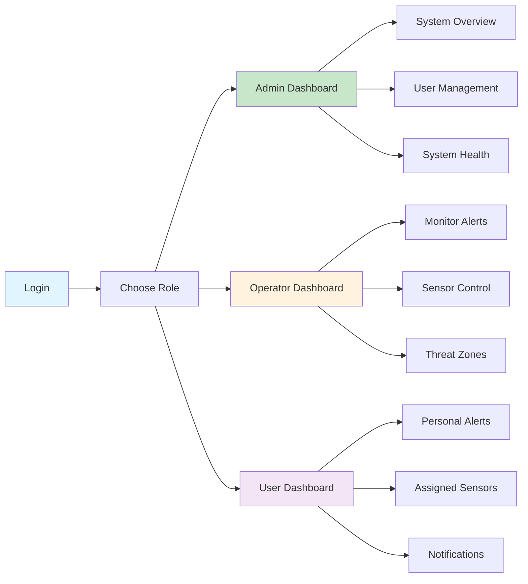
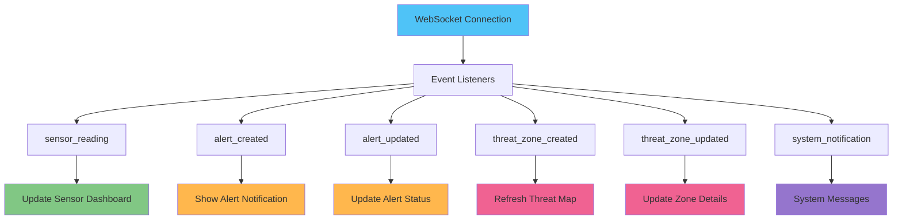
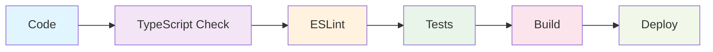
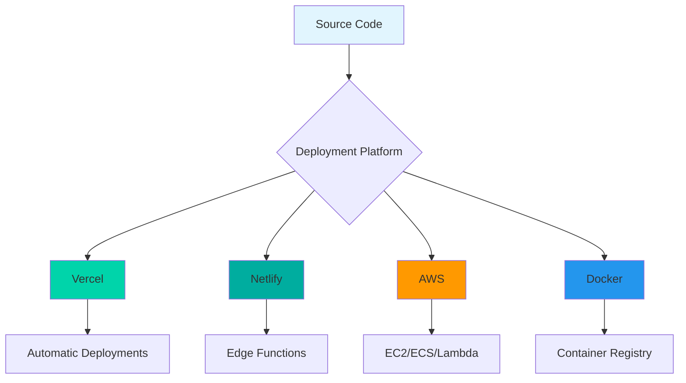

# 🛡️ Threat Monitoring System

<div align="center">


**A comprehensive real-time threat monitoring and response system with AI-powered predictive analytics**

[🚀 Live Demo](#demo) • [📖 Documentation](#documentation) • [🎯 Features](#features) • [🛠️ Installation](#installation)

</div>

---

## 📸 System Overview

### 🎯 Main Dashboard
*Real-time monitoring with role-based access control*


> **Note**: Screenshot shows the admin dashboard with system health metrics, active alerts, and threat zone monitoring

### 🗺️ Interactive Threat Map
*Live threat zone visualization with evacuation routes*


> **Note**: Interactive map showing real-time threat zones, sensor locations, and evacuation routes

### 📊 Sensor Monitoring
*Real-time sensor data with threshold alerts*


> **Note**: Comprehensive sensor monitoring with historical data and alert thresholds

---

## 🏗️ System Architecture

### Complete Hardware-to-ML-to-Frontend Flow



### 📊 Data Flow Visualization



---

## 🎯 Features

<table>
<tr>
<td width="50%">

### 🔐 **Authentication & Security**
- 🔑 JWT-based authentication with refresh tokens
- 👥 Role-based access control (Admin, Operator, User)
- 🔒 Secure login/logout with session management
- 📧 Password reset functionality
- 🛡️ API endpoint protection

### 📊 **Multi-Role Dashboards**
- 👑 **Admin Dashboard**: System overview, user management, system health
- ⚙️ **Operator Dashboard**: Alert management, sensor monitoring, operations control
- 👤 **User Dashboard**: Personal alerts, assigned sensors, threat zone notifications

### 🔍 **Advanced Sensor Management**
- 📡 Real-time sensor data monitoring
- 🔄 Sensor status tracking (active, inactive, error)
- 📈 Historical data visualization with charts
- ⚠️ Threshold configuration and alerts
- 🔋 Battery level monitoring
- 📍 Location-based sensor mapping

</td>
<td width="50%">

### 🚨 **Intelligent Alert System**
- ⚡ Real-time alert notifications
- 🎯 Severity-based classification (Low, Medium, High, Critical)
- ✅ Alert acknowledgment and resolution workflow
- 📊 Alert history and analytics
- ➕ Custom alert creation
- 📧 Email and push notifications

### 🗺️ **Threat Zone Management**
- 🌍 Interactive threat zone visualization
- 🤖 AI-powered predictive threat modeling
- 🚪 Evacuation route planning
- 👥 Population impact assessment
- 📊 Real-time threat level monitoring
- 📈 Historical threat zone analysis

### 🔔 **Real-time Notifications**
- ⚡ WebSocket real-time updates
- 🌐 Browser push notifications
- 📧 Email notifications
- ⚙️ Notification preferences management
- 📋 Notification history

</td>
</tr>
</table>

### 🎮 **Interactive Features Demo**



## 🛠️ Technology Stack

<div align="center">

### **Frontend Technologies**


### **Backend & Database**


### **ML & Analytics**


</div>

### 🏗️ **Architecture Components**

<table>
<tr>
<td width="33%">

#### **Frontend Layer**
- 🚀 **Next.js 14** - React framework with App Router
- 📘 **TypeScript** - Type-safe development
- 🎨 **Tailwind CSS** - Utility-first CSS framework
- 🧩 **Radix UI** - Accessible component primitives
- 🎯 **Lucide React** - Beautiful icons
- 📊 **Recharts** - Data visualization
- ⚡ **Socket.io Client** - Real-time communication

</td>
<td width="33%">

#### **Backend Layer**
- 🟢 **Node.js** - Server runtime
- 🚀 **Express.js** - Web framework
- 🍃 **MongoDB** - NoSQL database
- 🔐 **JWT** - Authentication
- 📡 **WebSocket** - Real-time updates
- 🔄 **Mongoose** - ODM for MongoDB

</td>
<td width="33%">

#### **ML & Analytics**
- 🐍 **Python** - ML processing
- 🧠 **TensorFlow** - Deep learning
- 📊 **Pandas** - Data manipulation
- 🔬 **Scikit-learn** - ML algorithms
- 📈 **NumPy** - Numerical computing
- 🔍 **OpenCV** - Computer vision

</td>
</tr>
</table>

### 🔄 **State Management & Integration**



## 📁 Project Structure

<details>
<summary><strong>🔍 Click to expand project structure</strong></summary>

```
🛡️ threat-monitoring-system/
├── 📱 app/                          # Next.js App Router
│   ├── 🔐 auth/                     # Authentication pages
│   │   ├── login/                   # Login page
│   │   ├── register/                # Registration page
│   │   └── forgot-password/         # Password reset
│   ├── 📊 dashboard/                # Dashboard pages
│   │   ├── sensors/                 # Sensor management
│   │   ├── alerts/                  # Alert management
│   │   ├── threat-zones/            # Threat zone monitoring
│   │   ├── users/                   # User management
│   │   ├── reports/                 # Analytics & reports
│   │   └── system-architecture/     # System overview
│   ├── 🌐 api/                      # API routes
│   │   ├── auth/                    # Authentication endpoints
│   │   ├── sensors/                 # Sensor data endpoints
│   │   ├── alerts/                  # Alert management endpoints
│   │   └── threat-zones/            # Threat zone endpoints
│   ├── layout.tsx                   # Root layout
│   └── page.tsx                     # Home page
├── 🎯 src/
│   ├── 🧩 components/               # React components
│   │   ├── dashboard/               # Dashboard components
│   │   ├── sensors/                 # Sensor components
│   │   ├── alerts/                  # Alert components
│   │   ├── threatZones/             # Threat zone components
│   │   ├── maps/                    # Interactive maps
│   │   └── ui/                      # Reusable UI components
│   ├── 🔄 contexts/                 # React contexts
│   │   ├── SensorContext.tsx        # Sensor state management
│   │   ├── ThreatZoneContext.tsx    # Threat zone state
│   │   ├── AlertContext.tsx         # Alert management
│   │   └── AuthContext.tsx          # Authentication state
│   ├── 🌐 services/                 # API services
│   │   ├── api.js                   # Axios configuration
│   │   ├── authService.js           # Authentication API
│   │   ├── sensorService.js         # Sensor data API
│   │   ├── alertService.js          # Alert management API
│   │   ├── threatZoneService.js     # Threat zone API
│   │   ├── notificationService.js   # Notification API
│   │   └── socketService.js         # WebSocket service
│   ├── 🪝 hooks/                    # Custom hooks
│   ├── 📚 lib/                      # Utility libraries
│   └── 🎨 types/                    # TypeScript definitions
├── 🖥️ backend/                      # Backend server
│   ├── 🗄️ models/                   # Database models
│   ├── 🛣️ routes/                   # API routes
│   ├── 🎛️ controllers/              # Route controllers
│   ├── 🔧 middleware/               # Express middleware
│   └── 🔧 config/                   # Configuration files
├── 🤖 model/                        # ML processing
│   ├── 📊 data/                     # Training data
│   ├── 🧠 models/                   # ML models
│   ├── 📓 notebooks/                # Jupyter notebooks
│   └── 🔬 scripts/                  # Training scripts
├── 🌍 public/                       # Static assets
│   ├── 🖼️ images/                   # Images & screenshots
│   └── 🎯 icons/                    # Application icons
└── 📚 docs/                         # Documentation
    ├── 🏗️ architecture.md           # System architecture
    ├── 🔌 api.md                    # API documentation
    └── 🚀 deployment.md             # Deployment guide
```

</details>

## 🚀 Getting Started

### 📋 Prerequisites

<table>
<tr>
<td width="50%">

#### **System Requirements**
- 🟢 **Node.js** 18+
- 📦 **npm** or **yarn**
- 🗄️ **MongoDB** 8.0+
- 🐍 **Python** 3.9+ (for ML models)

</td>
<td width="50%">

#### **Development Tools**
- 💻 **VS Code** (recommended)
- 🔧 **Git** for version control
- 🐳 **Docker** (optional)
- 📊 **MongoDB Compass** (optional)

</td>
</tr>
</table>

### ⚡ Quick Start

<details>
<summary><strong>🔧 Step-by-step installation</strong></summary>

#### **1. 📥 Clone the repository**
```bash
git clone <repository-url>
cd threat-monitoring-system
```

#### **2. 📦 Install dependencies**
```bash
# Frontend dependencies
npm install

# Backend dependencies
cd backend && npm install

# ML model dependencies
cd ../model && pip install -r requirements.txt
```

#### **3. ⚙️ Environment Setup**
```bash
# Copy environment templates
cp .env.local.example .env.local
cp backend/.env.example backend/.env
```

**Update the environment variables:**
```env
# Frontend (.env.local)
NEXT_PUBLIC_API_URL=http://localhost:3001/api
NEXT_PUBLIC_SOCKET_URL=http://localhost:3001
NEXT_PUBLIC_ML_API_URL=http://localhost:5000

# Backend (.env)
MONGODB_URI=mongodb://localhost:27017/threat_monitoring
JWT_SECRET=your_jwt_secret_here
PORT=3001

# ML Model (.env)
MODEL_API_PORT=5000
DATA_PATH=./data
```

#### **4. 🗄️ Database Setup**
```bash
# Start MongoDB (if not running)
mongod

# Seed the database with sample data
cd backend && npm run seed
```

#### **5. 🚀 Start the services**

**Option A: Start all services individually**
```bash
# Terminal 1: Frontend
npm run dev

# Terminal 2: Backend
cd backend && npm run dev

# Terminal 3: ML Model
cd model && python app.py
```

**Option B: Start with Docker Compose**
```bash
docker-compose up -d
```

#### **6. 🌐 Open your browser**
Navigate to [http://localhost:3000](http://localhost:3000)

</details>

### 🔑 Demo Credentials

<table>
<tr>
<th>Role</th>
<th>Email</th>
<th>Password</th>
<th>Access Level</th>
</tr>
<tr>
<td>👑 <strong>Admin</strong></td>
<td><code>admin@example.com</code></td>
<td><code>admin123</code></td>
<td>Full system access</td>
</tr>
<tr>
<td>⚙️ <strong>Operator</strong></td>
<td><code>operator@example.com</code></td>
<td><code>operator123</code></td>
<td>Operations & monitoring</td>
</tr>
<tr>
<td>👤 <strong>User</strong></td>
<td><code>user@example.com</code></td>
<td><code>user123</code></td>
<td>Personal dashboard</td>
</tr>
</table>

### 🎮 First Steps After Login



## 🔌 API Integration

### 🌐 RESTful API Endpoints

<table>
<tr>
<td width="50%">

#### **Core Endpoints**
- 🔐 **Authentication**: `/api/auth/*`
  - `POST /api/auth/login`
  - `POST /api/auth/register`
  - `POST /api/auth/refresh`
  - `POST /api/auth/logout`

- 📡 **Sensors**: `/api/sensors/*`
  - `GET /api/sensors`
  - `POST /api/sensors`
  - `PUT /api/sensors/:id`
  - `DELETE /api/sensors/:id`

- 🚨 **Alerts**: `/api/alerts/*`
  - `GET /api/alerts`
  - `POST /api/alerts`
  - `PUT /api/alerts/:id/acknowledge`
  - `PUT /api/alerts/:id/resolve`

</td>
<td width="50%">

#### **Advanced Features**
- 🗺️ **Threat Zones**: `/api/threat-zones/*`
  - `GET /api/threat-zones/active`
  - `POST /api/threat-zones/predict`
  - `PUT /api/threat-zones/:id`

- 👥 **Users**: `/api/users/*`
  - `GET /api/users`
  - `POST /api/users`
  - `PUT /api/users/:id`

- 🔔 **Notifications**: `/api/notifications/*`
  - `GET /api/notifications`
  - `POST /api/notifications/send`
  - `PUT /api/notifications/:id/read`

</td>
</tr>
</table>

### ⚡ Real-time WebSocket Events



### 📊 API Response Format

```json
{
  "success": true,
  "data": {
    "sensors": [...],
    "pagination": {
      "page": 1,
      "limit": 10,
      "total": 50
    }
  },
  "message": "Sensors retrieved successfully",
  "timestamp": "2024-01-15T10:30:00Z"
}
```

## 🛠️ Development

### 📋 Code Organization

<table>
<tr>
<td width="50%">

#### **Frontend Architecture**
- 🌐 **Services**: API integration and business logic
- 🔄 **Contexts**: Global state management
- 🧩 **Components**: Reusable UI components
- 🪝 **Hooks**: Custom React hooks
- 📝 **Types**: TypeScript type definitions

#### **Development Workflow**


</td>
<td width="50%">

#### **Best Practices**
- ✅ **TypeScript** for type safety
- ⚛️ **React** best practices
- 🛡️ **Error handling** implementation
- ⏳ **Loading states** for better UX
- ♿ **Accessibility** compliance
- 📱 **Responsive design** principles

#### **Code Quality Tools**
- 🔍 **ESLint** - Code linting
- 🎨 **Prettier** - Code formatting
- 🧪 **Jest** - Unit testing
- 🎭 **Testing Library** - Component testing
- 📊 **TypeScript** - Type checking

</td>
</tr>
</table>

### 🧪 Testing

<details>
<summary><strong>🔬 Testing Commands</strong></summary>

```bash
# Run all tests
npm test

# Run tests in watch mode
npm run test:watch

# Run tests with coverage report
npm run test:coverage

# Run specific test file
npm test -- AlertList.test.tsx

# Run tests for specific component
npm test -- --testNamePattern="Alert"

# Update test snapshots
npm test -- --updateSnapshot
```

#### **Test Coverage Goals**
- 🎯 **Components**: >80% coverage
- 🔧 **Services**: >90% coverage
- 🪝 **Hooks**: >85% coverage
- 🔄 **Contexts**: >75% coverage

</details>

### 🚀 Development Scripts

```bash
# Development server
npm run dev              # Start frontend dev server
npm run dev:backend      # Start backend dev server
npm run dev:ml          # Start ML model server
npm run dev:all         # Start all services

# Building
npm run build           # Build for production
npm run build:analyze   # Analyze bundle size

# Code Quality
npm run lint            # Run ESLint
npm run lint:fix        # Fix ESLint issues
npm run type-check      # TypeScript type checking
npm run format          # Format code with Prettier

# Database
npm run seed            # Seed database with sample data
npm run db:reset        # Reset database
npm run db:migrate      # Run database migrations
```

## 🚀 Deployment

### 🏗️ Production Build

<table>
<tr>
<td width="50%">

#### **Standard Deployment**
```bash
# Build the application
npm run build

# Start production server
npm start

# Or use PM2 for process management
pm2 start npm --name "threat-monitor" -- start
```

#### **Environment Variables**
```env
# Production Environment
NEXT_PUBLIC_API_URL=https://api.yourapp.com
NEXT_PUBLIC_SOCKET_URL=https://ws.yourapp.com
NEXTAUTH_SECRET=your_production_secret
NEXTAUTH_URL=https://yourapp.com
NODE_ENV=production
```

</td>
<td width="50%">

#### **Docker Deployment**
```dockerfile
FROM node:18-alpine
WORKDIR /app
COPY package*.json ./
RUN npm ci --only=production
COPY . .
RUN npm run build
EXPOSE 3000
CMD ["npm", "start"]
```

#### **Docker Compose**
```yaml
version: '3.8'
services:
  frontend:
    build: .
    ports:
      - "3000:3000"
    environment:
      - NODE_ENV=production
    depends_on:
      - backend
      - mongodb
```

</td>
</tr>
</table>

### ☁️ Cloud Deployment Options



---

## 🤝 Contributing

### 🔄 Development Workflow

1. **🍴 Fork the repository**
2. **🌿 Create a feature branch**
   ```bash
   git checkout -b feature/amazing-feature
   ```
3. **💻 Make your changes**
4. **🧪 Add tests if applicable**
5. **📝 Commit your changes**
   ```bash
   git commit -m "Add amazing feature"
   ```
6. **🚀 Push to the branch**
   ```bash
   git push origin feature/amazing-feature
   ```
7. **📬 Submit a pull request**

### 📋 Contribution Guidelines

- Follow the existing code style
- Write meaningful commit messages
- Add tests for new features
- Update documentation as needed
- Ensure all tests pass before submitting

---

## 📄 License

This project is licensed under the **MIT License** - see the [LICENSE](LICENSE) file for details.

---

## 🆘 Support & Documentation

<div align="center">

### 📚 **Documentation Links**

[](./docs/architecture.md)
[](./docs/api.md)
[](./docs/user-guide.md)
[](./docs/deployment.md)

### 💬 **Get Help**

- 🐛 **Bug Reports**: [Create an issue](../../issues/new?template=bug_report.md)
- 💡 **Feature Requests**: [Request a feature](../../issues/new?template=feature_request.md)
- 💬 **Discussions**: [Join the discussion](../../discussions)
- 📧 **Contact**: [development-team@yourapp.com](mailto:development-team@yourapp.com)

</div>

---

<div align="center">

**⭐ Star this repository if you find it helpful!**

Made with ❤️ by the Threat Monitoring Team

</div>
